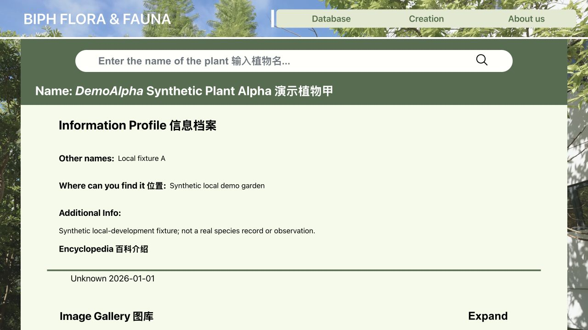

# BiphFlora

[](https://github.com/LQ458/biphflora/actions/workflows/verify.yml)

[Live application](https://www.biphflora.com/) ·
[System overview](docs/architecture/system-overview.md) ·
[Evidence index](docs/evidence/README.md) ·
[Deployment guidance](docs/operations/deployment-readiness.md)

BiphFlora is a bilingual React and Express application for discovering,
documenting, contributing to, and reviewing campus plant and bird records. It
combines multilingual fuzzy search, seasonal image galleries, creative work,
and a moderated contribution workflow while retaining the existing API and
MongoDB contracts.

| Local catalogue                                                                                           | Plant detail                                                                                               |
| --------------------------------------------------------------------------------------------------------- | ---------------------------------------------------------------------------------------------------------- |
|  |  |

_The screenshots are generated from the deterministic local fixture. They
contain no production account, attribution, log, or media data._

## What the application supports

- Chinese, English, Latin-name, alias, and fuzzy catalogue search.
- Public catalogue, glossary, detail, seasonal gallery, and creation views.
- Authenticated submissions and edits with administrator review boundaries.
- JPEG, PNG, and WebP upload validation with canonical media retention.
- Responsive 480, 960, and 1600 pixel WebP delivery with lazy loading,
  `srcset`, legacy fallback, and coordinated rename/delete behavior.
- MongoDB-backed records, Redis-backed active sessions, liveness/readiness
  endpoints, and opt-in privacy-conscious operational telemetry.

## Verified operational snapshot

The following values have a recorded source, definition, collection date, and
limitation. They are not estimates of users or availability.

| Area                      | Verified observation                                                                                                                                                                                                                |
| ------------------------- | ----------------------------------------------------------------------------------------------------------------------------------------------------------------------------------------------------------------------------------- |
| Public history            | Successful public-page evidence exists from 2024-01-15; this is a lower bound, not proof of uninterrupted uptime.                                                                                                                   |
| Current catalogue         | 153 plant documents (152 approved, 1 pending), 970 picture documents, 27 artwork documents, and 18 approved creation entries at the 2026-07-22 production snapshot.                                                                 |
| Retained traffic evidence | 1.13 million Nginx entries were analyzed; strict filtering retained 182,149 recognized product-route requests and 37,409 successful document-load candidates from 2024-10-31 through 2026-07-22. Requests are not visits or people. |
| Recorded workflows        | Retained logs contain 964 filtered successful write, upload, review, and delete endpoint responses. They are response counts, not unique actions or contributors.                                                                   |
| Media delivery            | A full 1,033-file, 2.11 GB canonical-media population has 3,099 paired responsive derivatives across three widths; originals and legacy URLs remain available.                                                                      |
| Verification              | 39 backend and 19 frontend tests, strict frontend lint, production builds, production-dependency audit, and committed-secret scanning.                                                                                              |

Valid visits, verified unique visitors, historical uptime, and verified
contributor or organization headcount remain unavailable. See the
[metric catalog](docs/evidence/metric-catalog.md), the
[traffic report](docs/evidence/traffic-report-2026-07-23.md), and the
[media calculation](docs/evidence/cv-impact-report-2026-07-23.md) before
reusing any number.

## Architecture

```text
React SPA ── HTTP/JSON ──> Express
                              ├─ MongoDB: catalogue, users, edits, media paths
                              ├─ Redis: active login-session tokens
                              └─ filesystem: canonical and derived media
```

Production places Nginx in front of the separately built React client and the
Express process. The backend is composed from focused authentication, catalog,
content, telemetry, runtime, and media boundaries while compatibility handlers
remain in `app.js` during the gradual migration. MongoDB references media
paths; it does not contain the image bytes, so database and filesystem
consistency are treated as separate operational concerns.

The complete request, authentication, upload, responsive-media, fallback, and
failure flows are documented in the
[system overview](docs/architecture/system-overview.md) and
[image-delivery design](docs/architecture/image-delivery-design.md).

## Local development

Requirements: Node.js 18.17 or newer, npm, Docker with Compose, and two terminal
windows.

```sh
cp .env.example .env
npm ci
npm --prefix client ci
npm run dev:services
npm run seed:demo
npm run start
```

In the second terminal:

```sh
REACT_APP_Source_URL=http://127.0.0.1:3001 npm --prefix client start
```

Open `http://localhost:3000`. The seed command is idempotent and only accepts a
literal loopback MongoDB URL targeting the fixed `biphflora_demo` database. It
creates three anonymous synthetic records and locally generated image
derivatives; it does not create accounts or copy production data.

Stop the repository-managed local services with:

```sh
npm run dev:services:down
```

The browser uses `REACT_APP_Source_URL` when supplied and otherwise defaults to
the production-compatible `/api` prefix. The backend exposes
`GET /health/live` for process liveness and `GET /health/ready` for MongoDB and
Redis readiness without returning configuration values.

## Verification

```sh
npm run verify
npm run audit:production
npm run evidence:search-performance
```

`npm run verify` runs backend tests, strict frontend lint, focused frontend
tests, and the production client build. The production dependency trees audit
cleanly at the recorded baseline; remaining Create React App development/build
chain findings are tracked separately in
[dependency status](docs/operations/dependency-status.md). No destructive
automatic dependency upgrade is part of the verification command.

## Security and data boundaries

JWT requests support both the standard `Bearer` form and the legacy bare-token
form during the compatibility period. Protected operations require the current
Redis token and MongoDB user state; administrator routes additionally recheck
the current administrator flag. Public user responses explicitly exclude
password fields.

Do not commit `.env` files, credentials, raw logs, production media, build
output, database dumps, account data, or attribution labels. Evidence scripts
aggregate data at its source and retain definitions and limitations rather than
raw identifiers. Media backfills, database migrations, Nginx changes, service
restarts, and production deployments remain explicit operational actions.

Please read [CONTRIBUTING.md](CONTRIBUTING.md) and
[SECURITY.md](SECURITY.md) before making changes.

## License

This repository is maintained for private, non-commercial use under the terms
in [LICENSE](LICENSE). It is not an open-source commercial license.
