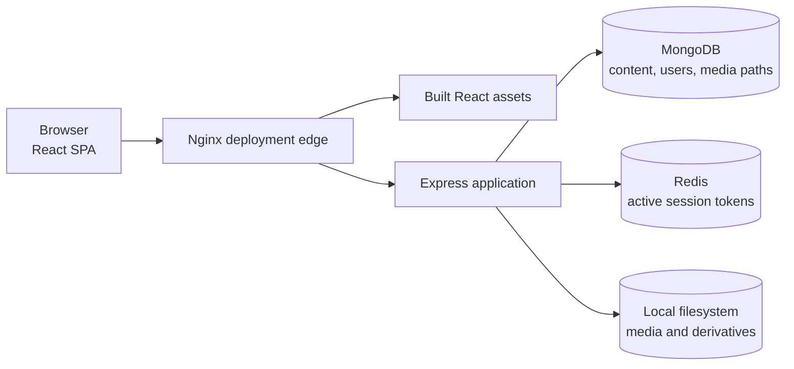
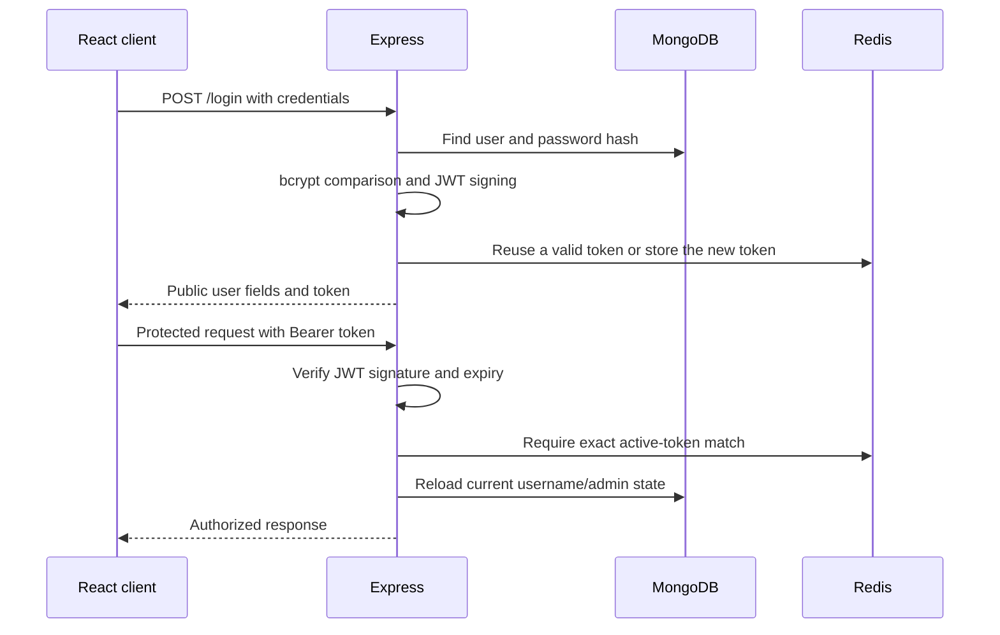
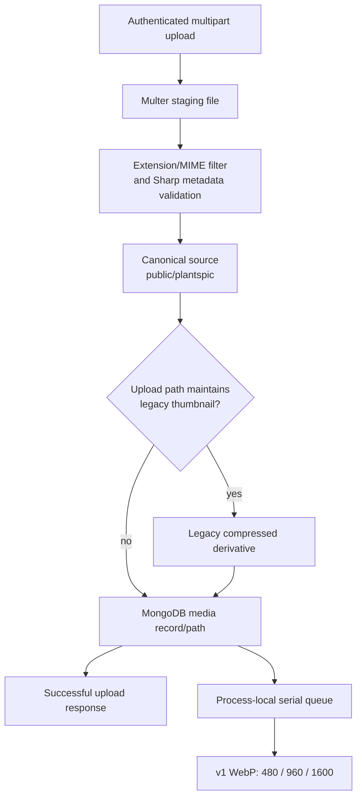

# System overview

Last source review: 2026-07-23.

This document describes the architecture implemented in this repository. It
does not describe a service-level agreement, traffic volume, user count, or
performance guarantee. Production Nginx configuration is not stored here, so
the edge behavior below is a deployment boundary rather than a claim about an
exact `location` or rewrite rule.

## System at a glance

The documented deployment arrangement places Nginx in front of the frontend
and Express processes. The React client uses `/api` as its default API origin,
while Express declares routes such as `/login` and `/catalog/names` at its own
root. A deployment using the default client setting must therefore route the
`/api` namespace to Express appropriately. The repository does not contain the
Nginx file needed to state whether that is done by rewriting, prefix removal,
or an equivalent proxy rule.

## Runtime responsibilities

| Component                | Responsibility                                                                                                                                                                               | State or boundary                                                                                            |
| ------------------------ | -------------------------------------------------------------------------------------------------------------------------------------------------------------------------------------------- | ------------------------------------------------------------------------------------------------------------ |
| React 18 client          | SPA routing, catalogue/search views, upload and administration UI, API calls, client-side catalogue caching, and responsive image selection                                                  | Built separately under `client/`; API origin defaults to `/api` and may be configured at build time          |
| Nginx                    | Deployment edge in front of the built client and Express                                                                                                                                     | Configuration and changes are operationally managed outside this repository                                  |
| Express                  | JSON and multipart endpoints, authentication and authorization boundaries, MongoDB access, static media delivery, image lifecycle coordination, health endpoints, and optional observability | `app.js` composes routers, middleware, models, and media services; `server.js` owns startup and shutdown     |
| MongoDB through Mongoose | Durable application records: users, plant and bird catalogue entries, media metadata and paths, submissions, featured content, counters, and optional events                                 | MongoDB stores references such as `/plantspic/<filename>`; image bytes are not stored in MongoDB             |
| Redis                    | Active-token lookup keyed by username                                                                                                                                                        | A signed JWT is not sufficient for a protected request unless it matches the token currently stored in Redis |
| Local filesystem         | Temporary uploads, canonical media, legacy compressed media, and versioned responsive derivatives                                                                                            | Media consistency spans filesystem and MongoDB without a cross-store transaction                             |

The React application lazy-loads most route bundles. Its shared Axios client
adds the locally stored token only to requests directed at the configured API
origin. Catalogue name requests use a five-minute in-memory client cache and
coalesce duplicate in-flight requests; this cache is per browser page, not a
server cache.

Express applies request context, optional request/audit middleware, response
compression, body parsing, static media handling, CORS, and the routers and
legacy handlers. Public catalogue queries generally select authorized entries.
Mutation routes use either authenticated-user or administrator boundaries
according to the operation.

## Request and data flow

### Page and public catalogue request

1. The browser loads the built React application through the deployment edge.
2. React constructs an API URL from the configured origin, `/api` by default.
3. Nginx forwards the API request to Express according to deployment-managed
   configuration.
4. Express routes the request to a focused router or a handler in `app.js`.
5. Mongoose reads the relevant MongoDB collection and Express returns JSON.
6. The UI renders MongoDB media paths through the shared URL and image helpers,
   which turn a stored `/plantspic/...` path into an API-served media URL.

JSON and media have different dependencies. A catalogue response depends on
MongoDB, while a request for a known media URL can be served from the filesystem
without a new MongoDB read.

### Authentication and authorization

- Password hashes are checked with bcrypt. Login issues a signed JWT with the
  username and admin claim, then records the active token in Redis.
- The client stores the token in browser local storage and normally sends it as
  `Authorization: Bearer <token>`.
- During the compatibility period, middleware accepts both the Bearer form and
  the earlier bare-token header form.
- `requireAuth` verifies the JWT, requires an exact Redis token match, and
  reloads the current user from MongoDB. `requireAdmin` additionally requires
  the current MongoDB user to have administrator status; a stale JWT admin claim
  does not grant access on its own.
- Missing or invalid authentication returns `401`. An authenticated non-admin
  user at an admin boundary receives `403`. If Redis cannot establish the
  session decision, protected requests fail closed with `503`.
- Logout removes the Redis session entry before reporting success. User
  deletion and expired-token cleanup attempt to remove it on a best-effort
  basis.

This design gives the application server-side session revocation and
effectively one stored active token per username, while preserving the existing
JWT client contract.

## Media storage and delivery

### Storage tiers

| Tier              | Filesystem path pattern                                | Purpose                                                                               |
| ----------------- | ------------------------------------------------------ | ------------------------------------------------------------------------------------- |
| Upload staging    | `uploads/<generated-name>`                             | Temporary Multer input; removed after processing                                      |
| Canonical source  | `public/plantspic/<filename>`                          | Path referenced by MongoDB and source used for responsive generation                  |
| Legacy compressed | `public/compressed/plantspic/<filename>`               | Older thumbnail-oriented compatibility derivative; not every upload route creates one |
| Responsive v1     | `public/variants/v1/<width>/plantspic/<filename>.webp` | Additive WebP derivatives at 480, 960, and 1600 pixels                                |

“Canonical source” means the file addressed by the durable MongoDB path and
used as the derivative input. For a new upload it may already have been
auto-oriented and encoded by Sharp; it is not a promise that the raw multipart
bytes are retained unchanged.

### Upload to derivative flow

The upload boundary accepts JPEG, PNG, and WebP, checks the configured per-file
and batch limits, compares MIME information with decoded image metadata, and
uses generated filenames. Sharp writes through temporary output files before
publishing the canonical and legacy outputs. Failed request paths attempt to
remove staged/output files and any records already created.

The main picture and bird-picture upload paths create both the canonical source
and the legacy compressed derivative before saving media records. Creation and
art upload paths create the canonical source but may not create the legacy
compressed tier. All of these successful media uploads schedule responsive
variants from the canonical source after their database work.

Responsive generation is deliberately asynchronous with respect to the upload
response:

- work is serialized by an in-process promise queue;
- an upload can succeed even if one or more WebP derivatives later fail;
- each width is generated independently, with pixel and processing-time limits;
- a same-directory temporary file and hard-link publication avoid overwriting
  an existing versioned output;
- graceful server shutdown stops accepting HTTP traffic, drains this queue, and
  then disconnects dependencies.

The queue is not a durable external job system. A process termination before
the graceful drain can leave variants absent, and there is no built-in
persistent retry. The repository includes a separate backfill script, but
running it is an explicit operational action rather than part of request
handling.

### Read fallback

The client emits `srcset` candidates for v1 WebP URLs. Delivery is progressive:

1. An existing versioned file is served with a long immutable cache policy.
2. If that versioned file is absent, the same Express URL tries the legacy
   compressed file, then the canonical source, with a short cache lifetime and
   an `X-Media-Variant: legacy-fallback` response marker.
3. If the image request itself errors in the browser, the shared image component
   removes `srcset` and walks the explicit compressed and canonical URLs once.
4. If no source works, the component renders its configured failed content.

This keeps a missing asynchronous derivative from breaking an otherwise valid
upload and avoids a MongoDB schema migration for variant metadata.

### Rename and delete

When an approved plant or bird name change also changes media filenames, the
request handler renames the canonical file, schedules derivative work on the
serial queue, and then updates its MongoDB media record. The queued service
moves the legacy compressed file and existing v1 variants without overwriting
destinations, then tries to regenerate variants from the new canonical path.
Derivative failures are logged and do not roll back the whole edit response.
There can therefore be a short interval in which the canonical path is current
and derivatives are still catching up.

Deletion uses the queue in the opposite order: remove the legacy compressed and
v1 derivative files, require that no derivative removal failed, and then unlink
the canonical file. The associated MongoDB record is deleted after that flow
succeeds in the single-media handlers. Multi-item catalogue deletion catches
per-media failures while other deletions proceed, so it can be partially
complete. There is no transaction spanning filesystem operations and MongoDB.

## Health and failure boundaries

| Boundary                  | Implemented behavior                                                                                                                   | Residual limitation                                                                                               |
| ------------------------- | -------------------------------------------------------------------------------------------------------------------------------------- | ----------------------------------------------------------------------------------------------------------------- |
| Nginx or frontend process | Outside the Node application and repository-managed configuration                                                                      | Exact routing, cache, TLS, and edge failure behavior must be verified operationally                               |
| Express process           | `/health/live` reports process liveness; graceful shutdown closes HTTP, drains image work, and disconnects dependencies                | Listening begins before dependency connection completes, so liveness alone does not mean the application is ready |
| MongoDB                   | `/health/ready` reports not ready when MongoDB is unavailable                                                                          | Catalogue and user data requests can fail; filesystem media and process liveness are separate                     |
| Redis                     | `/health/ready` reports not ready; protected routes fail closed when a session decision cannot be made                                 | Public content may remain usable, but authenticated work is intentionally unavailable                             |
| Filesystem                | Safe-path checks constrain media and derivative operations to expected trees; missing derivatives are tolerated on reads               | A missing canonical file cannot be reconstructed from MongoDB metadata                                            |
| Upload processing         | Validation and best-effort cleanup run before an error response; database records created in the request are rolled back where tracked | Filesystem and MongoDB changes are sequential, not atomic                                                         |
| Variant generation        | Failures are isolated by width and logged; reads fall back to existing media                                                           | Queue state is process-local and has no durable retry                                                             |
| Rename/delete             | Canonical and derivative lifecycle functions coordinate known tiers                                                                    | Per-file error handling and the lack of a cross-store transaction allow partial completion                        |

Readiness is true only when both MongoDB and Redis are ready. This is a
dependency signal exposed by the application, not an uptime claim.

## Progressive compatibility choices

The current design favors reversible additions over a storage or API cutover:

- Express retains existing route names, request/response shapes, and MongoDB
  field conventions while newer routers and services isolate selected
  responsibilities.
- MongoDB keeps the established `/plantspic/...` path. Responsive media is
  derived from that path instead of adding variant records or migrating
  documents.
- The `v1` directory makes derivative URLs explicit and versionable. Only those
  versioned outputs receive immutable caching; fallback content remains
  short-lived.
- Legacy compressed and canonical URLs remain readable while React adopts
  responsive URLs. Missing new files degrade to old files rather than turning
  an upload into an error.
- Both Bearer and bare JWT authorization headers remain accepted during client
  migration, while Redis matching and current-user checks strengthen the server
  boundary.
- A serial in-process image queue limits concurrent Sharp work and fits the
  existing filesystem deployment, at the cost of durability and horizontal
  coordination.
- The repository does not introduce object storage, a CDN contract, a durable
  worker, AVIF variants, or an Nginx configuration change. Those would require
  separate migration, operational, and rollback plans.

## Source map

The main implementation references for this overview are:

- `client/src/App.js`, `client/src/api/http.js`,
  `client/src/api/catalog.js`, `client/src/tools/url.js`, and
  `client/src/components/MediaImage.js`;
- `app.js`, `server.js`, and `runtime.js`;
- `middleware/auth.js`, `routes/auth.js`, `routes/catalog.js`, and
  `routes/content.js`;
- `models/uploadPolicy.js`, `models/compression.js`,
  `services/mediaFiles.js`, and `services/imageVariants.js`.
